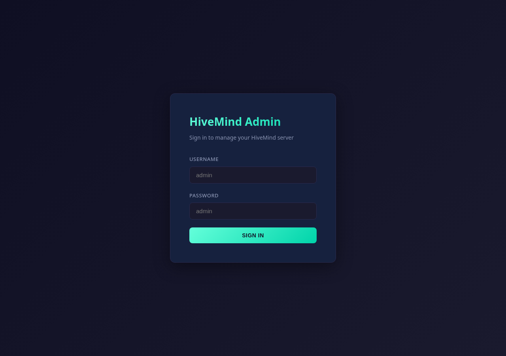

# Getting started, from scratch

This is for someone who has never touched HiveMind or OVOS before and
wants to turn a spare device (a Raspberry Pi, an old laptop, a mini PC)
into a networked speaker that other things can send audio and TTS to.

## What this actually is

There is no external account to sign up for. `hivemind-media-player`
is not a voice assistant you talk to — it never answers questions. It is
a **remote-controlled speaker**. Something else (Home Assistant, Music
Assistant, a script, another OVOS device) sends it standard OCP ("Open
Voice OS Common Play") commands — play this URL, pause, next track,
set the volume — over an encrypted HiveMind connection, and this device
plays the audio out of its speakers.

Two processes run on the player device:

- `hivemind-core`, a second, independent HiveMind hub dedicated to this
  player. It is not the same hub your voice assistant satellites talk
  to — it is a small, separate hub whose only job is to receive OCP
  commands and hand them to the player.
- `HiveMindPlayerProtocol` (from this repo, packaged as
  `hivemind-player-agent-plugin`), running inside that hub. It embeds
  `ovos-media`, which does the actual playback; `ovos-audio` is also
  embedded, but only for TTS.

The reference deployment (this project's demo box) runs it in Docker,
listening on host port 5680, with its own isolated identity — it does
not share client credentials with any other HiveMind hub on the same
machine.

## 1. Install

Docker (recommended — you get a working `mpv`/`vlc` playback stack for
free):

```bash
git clone https://github.com/JarbasHiveMind/hivemind-media-player
cd hivemind-media-player
docker compose up -d
```

Check `docker-compose.yml` before running it — the HiveMind port
(`5678` inside the container) is what you map to a host port. If you
already run a HiveMind hub on the default `5678`, map this one to a
different host port (the demo deployment uses `5680:5678`) so the two
hubs don't collide.

From source, without Docker: see the [main README](../README.md#install)
— you need `ovos-media` and this plugin installed on the device with real
speakers attached (or a null audio sink, see below).

## 2. Configure the two files

**`~/.config/hivemind-core/server.json`** tells this hub to load the
player agent instead of a normal HiveMind agent:

```json
{
  "agent_protocol": {
    "module": "hivemind-player-agent-plugin",
    "hivemind-player-agent-plugin": {}
  }
}
```

**`~/.config/mycroft/mycroft.conf`** configures the TTS engine (read by the
embedded `ovos-audio`) and the `"media"` block that `ovos-media` reads for
its playback backends, declared under `media.audio_players` (and
`media.video_players` / `media.web_players` for those media types) keyed
by a local plugin name. See [configuration.md](configuration.md) for the
full reference. If the device is headless (no physical speakers, e.g. a
server or a container without real audio hardware), point playback at a
null sink instead of a real one — for example, an `ovos-media-audio-plugin-vlc`
entry with `--aout=dummy` in its own plugin config, or a system
`pulseaudio` with a `module-null-sink` loaded. Without a working audio
output — real or null — playback commands will still be accepted but
nothing will actually play, and the backend may error out trying to open
a device that doesn't exist.

In Docker, if you don't need to actually hear anything (testing the
protocol only), the base image's null-audio backend configuration already
gives you silent-but-successful playback.

## 3. Create a client credential and grant permissions

This is the step almost everyone forgets, and the symptom is silent:
commands are accepted by the hub but nothing happens on the player.

On the player device:

```bash
hivemind-core add-client
# note the Access Key, Password, and Node ID printed
```

Now whitelist the message types the controller is going to send. A
freshly added client can send **nothing** until you do this:

```bash
# replace 3 with the Node ID from add-client
hivemind-core allow-msg "ovos.common_play.play" 3
hivemind-core allow-msg "ovos.common_play.pause" 3
hivemind-core allow-msg "ovos.common_play.resume" 3
hivemind-core allow-msg "ovos.common_play.stop" 3
hivemind-core allow-msg "ovos.common_play.next" 3
hivemind-core allow-msg "ovos.common_play.previous" 3
hivemind-core allow-msg "speak" 3
```

See [permissions.md](permissions.md) for the complete list (volume
control, queueing, shuffle/repeat, etc.) — add only what your controller
actually needs.

## 4. Point a controller at it

On whatever machine will send commands, set its HiveMind identity to
this player's hub:

```bash
hivemind-client set-identity \
  --key <access_key> --password <password> \
  --host <player_device_ip> --port 5680 --siteid player
```

(Port `5680` matches the demo deployment's host mapping — use whatever
port you actually exposed.)

## 5. Verify a round trip

Start the hub if it isn't already running (`hivemind-core listen`, or
`docker compose up -d` if using Docker), then:

```bash
python hivemind-player-ctl.py play "http://example.com/audio/track.mp3"
```

Expected: the hub logs the incoming `ovos.common_play.play`, hands it to
`HiveMindPlayerProtocol`, which forwards it to the embedded `ovos-media`
daemon; the configured backend starts playing; you hear audio (or, on a
null sink, see the process start playing with no sound).
`hivemind-player-ctl.py pause` / `resume` / `next` should then behave as
expected.

If nothing happens: check `docker logs` (or the process's stdout) for a
message about a denied message type — that means step 3's `allow-msg`
was skipped or targeted the wrong Node ID.

## The admin panel

HiveMind hubs that expose an admin web UI show a sign-in screen like this
(from the project's reference deployment):



This session had no admin credentials for that instance, so this
screenshot stops at the login screen — it was not guessed or bypassed.
Once signed in, the panel lists connected clients, which is where you'd
confirm this player device shows up after `add-client`.

## Related

- [Architecture](architecture.md)
- [Configuration reference](configuration.md)
- [Permissions reference](permissions.md)
- [Home Assistant / Music Assistant integration](../README.md#home-assistant--music-assistant-integration)
